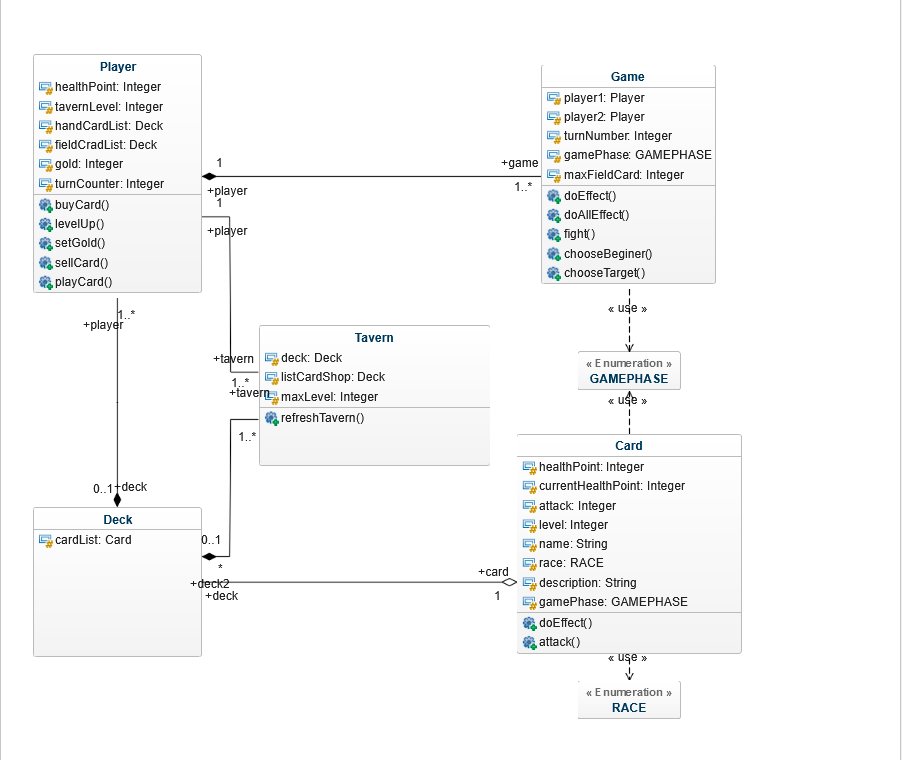

# ESIEA_Projet_POO
python version : 3.8.0
## Start the project
Linux & MacOSX
```shell
python3 -m venv .
source venv/bin/activate
which python
pip install -r requirements.txt
python3 App.py
```
## UML Diagram of the project


## For documentation on the project 
```shell
python -m pydoc -b 
```